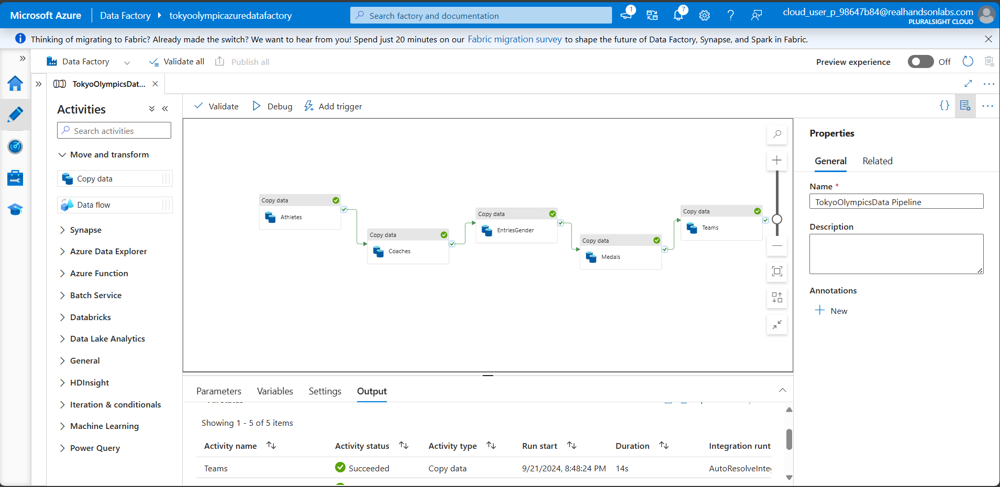
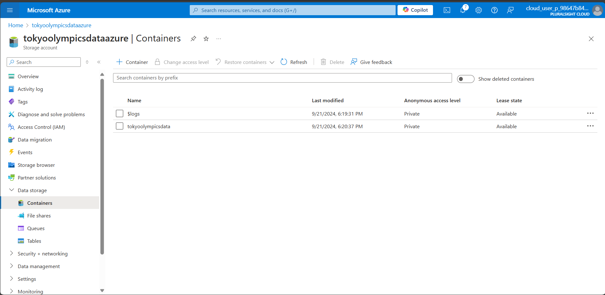
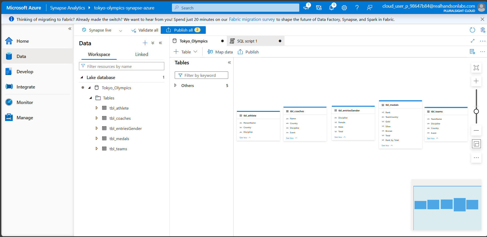

# Olympics-Data-Analytics-Azure

This project demonstrates how to leverage Microsoft Azure services for data ingestion, transformation, and analytics using the Tokyo 2021 Olympics dataset from [Kaggle](https://www.kaggle.com/datasets/arjunprasadsarkhel/2021-olympics-in-tokyo).

## Project Overview

The key components of this project include:

1. **Data Ingestion using Azure Data Factory**: The data from the Kaggle dataset was ingested into Azure Data Lake Gen 2 using the Copy Data tool in Azure Data Factory.
   
   

2. **Data Transformation using Azure Databricks**: After ingestion, the data was transformed in Azure Databricks to prepare it for analytics. The transformed data was stored back into Azure Data Lake Gen 2.
   
   

3. **Data Analytics using Azure Synapse**: Finally, the transformed data in the Azure Data Lake was connected to Azure Synapse for performing analytical queries and deriving insights from the data.
   
   

## Tech Stack

- **Azure Data Factory**: For data ingestion from the Kaggle dataset into Azure Data Lake Gen 2.
- **Azure Data Lake Storage (Gen 2)**: For storing raw and transformed data.
- **Azure Databricks**: For data transformation and preparation for analytics.
- **Azure Synapse Analytics**: For running analytical queries on the transformed data.

## Dataset

The dataset used in this project is sourced from [Kaggle: 2021 Olympics in Tokyo](https://www.kaggle.com/datasets/arjunprasadsarkhel/2021-olympics-in-tokyo). It contains detailed information about athletes, events, medals, and countries participating in the 2021 Tokyo Olympics.

## How to Run

1. Set up Azure Data Factory to ingest the dataset into Azure Data Lake Gen 2.
2. Use Azure Databricks to transform the ingested data.
3. Connect the transformed data to Azure Synapse for analytical queries.

## Screenshots

1. **Azure Data Factory Copy Data Tool**:
   

2. **Azure Data Lake Storage**:
   

3. **Azure Synapse Analytics**:
   
